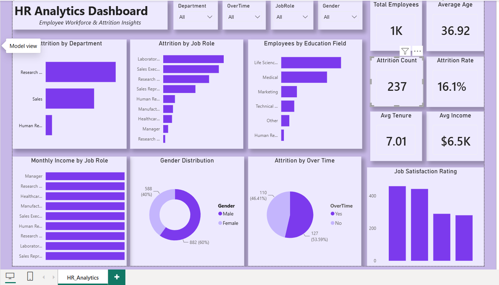

# 📊 HR Analytics Dashboard

Interactive Power BI dashboard analyzing workforce metrics and HR insights.

## Dashboard Preview

## Project Overview

This dashboard provides key HR insights to help monitor employee performance, workforce trends, and organizational metrics.

## Key Metrics

- Total Employees
- Attrition Rate
- Average Age
- Average Salary
- Department-wise Employees
- Gender Distribution

## Dashboard Features

- Employee overview
- Attrition analysis
- Department analysis
- Gender analysis
- Age distribution
- Interactive slicers

## Tools Used

- Power BI
- Power Query
- DAX
- Excel

## Files Included

- HR Analytics Dashboard.pbix
- HR Employee Data.xlsx
- HR Dashboard.png
- HR Analytics Dashboard.mp4
